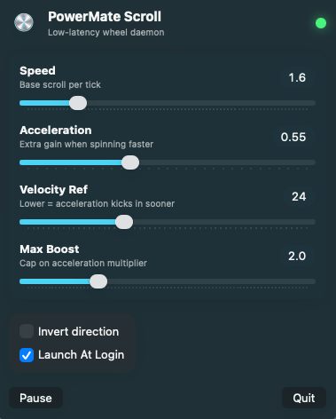

# PowerMateScroll (macOS)

A native menu bar app for Griffin PowerMate on macOS with low-latency HID scrolling, live tuning controls, and persistent settings.

<p align="center">
  
</p>

## Features

- Menu bar app UI (`PowerMateScroll.app`) with glass-style controls.
- Uses Liquid Glass APIs (`.glassEffect`, `GlassEffectContainer`) on macOS 26+ with fallback styling on older macOS.
- Direct HID input handling (`IOHIDManager`) for responsive scroll injection.
- Live tuning for speed and acceleration:
  - sensitivity
  - acceleration
  - velocity reference
  - max boost
  - invert
- Settings auto-save in `UserDefaults` and restore on launch.
- Launch-at-login support (from the app toggle and LaunchAgent install script).

## Install

```bash
./scripts/install.sh
```

Then grant Accessibility to:

- `/Applications/PowerMateScroll.app`

If the prompt does not appear, run:

```bash
open -na "/Applications/PowerMateScroll.app" --args --request-accessibility
```

Restart the running agent if needed:

```bash
launchctl kickstart -k gui/$(id -u)/io.github.byronhsu.powermate-scroll
```

## Build

```bash
./scripts/build.sh
```

Output binary:

- `build/powermate-scroll`

## Logs

- `~/Library/Logs/powermate-scroll.out.log`
- `~/Library/Logs/powermate-scroll.err.log`

## Uninstall

```bash
./scripts/uninstall.sh
```
